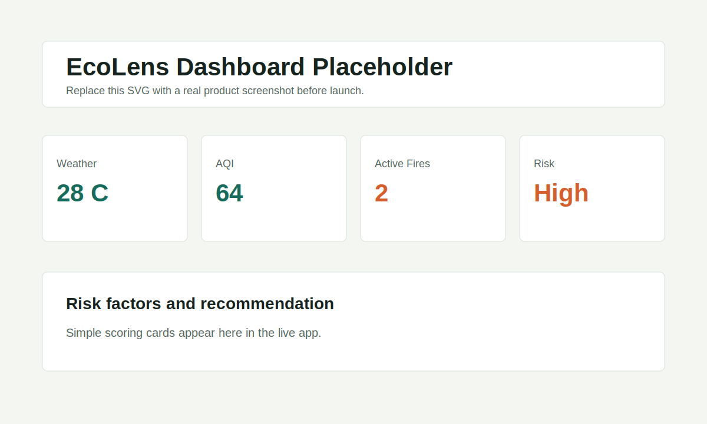
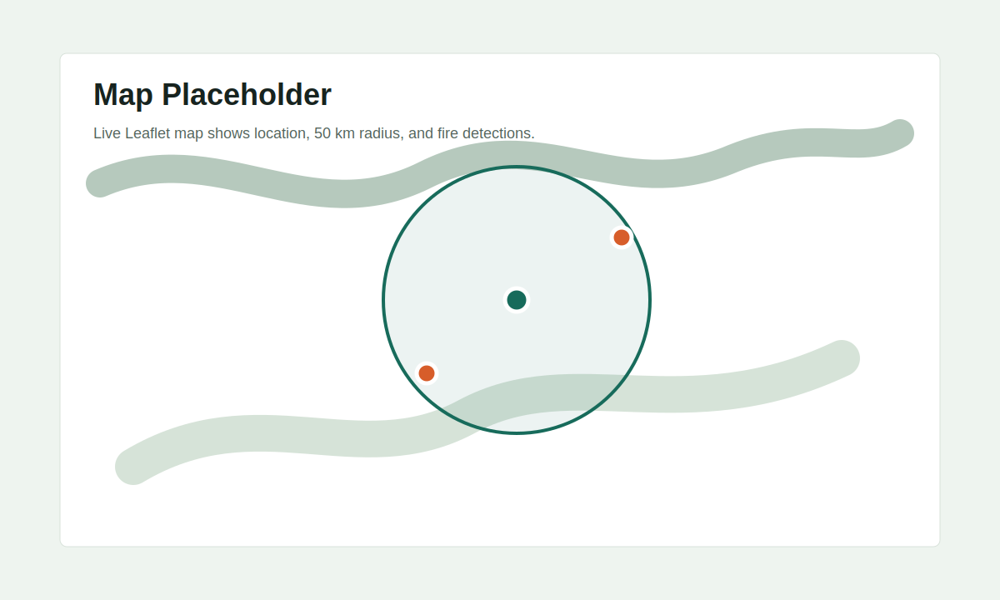

# EcoLens

EcoLens is a lightweight environmental risk analysis tool. Users enter a city, US ZIP Code, or latitude/longitude and receive weather, PM2.5 / AQI, nearby active fire detections, a simple risk level, a map, and an exportable report.



## Features

- Location search by city, US ZIP Code, or coordinates.
- Current weather-style signals from NOAA / National Weather Service forecast grid data.
- OpenAQ PM2.5 lookup and estimated US AQI.
- NASA FIRMS active fire detections within 50 km.
- Rule-based risk score: `Low`, `Moderate`, `High`, or `Extreme`.
- Leaflet map with user location, 50 km radius, and fire markers.
- Export report as Markdown or PDF.
- GitHub Actions checks for frontend build and Python tests.

## Tech Stack

- Frontend: React, Vite, TypeScript
- UI: Tailwind CSS
- Map: Leaflet, React Leaflet
- Backend: Python FastAPI
- Data APIs: NOAA / National Weather Service, OpenAQ, NASA FIRMS
- Geocoding helper: Open-Meteo Geocoding API and Zippopotam for US ZIP Codes
- Deployment: Vercel for frontend, Render or Railway for backend

## Project Structure

```text
.
├── backend/app          # FastAPI backend
├── src                  # React frontend
├── tests                # Python risk tests
├── docs/screenshots     # Demo screenshot placeholders
├── .github/workflows    # CI checks
├── API_USAGE.md
├── README.md
├── requirements.txt
└── package.json
```

## Prerequisites

- Node.js 20+
- Python 3.11+
- Optional API keys:
  - OpenAQ API key: https://explore.openaq.org/register
  - NASA FIRMS MAP_KEY: https://firms.modaps.eosdis.nasa.gov/api/map_key/

The app can run without optional API keys. Weather still works for supported US locations; OpenAQ and FIRMS cards will show setup messages until keys are configured.

## Quick Start

1. Clone the repository and enter it.

```bash
git clone https://github.com/YOUR_USERNAME/EcoLens.git
cd EcoLens
```

2. Create environment file.

```bash
cp .env.example .env
```

3. Install frontend dependencies.

```bash
npm install
```

4. Create and activate a Python virtual environment.

```bash
python3 -m venv .venv
source .venv/bin/activate
pip install -r requirements.txt
```

5. Start the backend.

```bash
uvicorn backend.app.main:app --reload --port 8000
```

6. In another terminal, start the frontend.

```bash
npm run dev
```

7. Open http://localhost:5173.

## Configuration

Edit `.env`:

```bash
FRONTEND_ORIGIN=http://localhost:5173
CONTACT_EMAIL=you@example.com
OPENAQ_API_KEY=your-openaq-key
NASA_FIRMS_MAP_KEY=your-firms-map-key
NASA_FIRMS_SOURCE=VIIRS_NOAA20_NRT
VITE_API_BASE_URL=http://localhost:8000
```

`CONTACT_EMAIL` is used in API `User-Agent` headers for NWS and geocoding requests.

## API Usage

See [API_USAGE.md](API_USAGE.md) for endpoint examples and external API notes.

## Risk Scoring

EcoLens uses transparent MVP rules:

- Hotter temperatures add risk.
- Lower humidity adds risk.
- Higher wind speed adds risk.
- Higher AQI adds health risk.
- Any NASA FIRMS active fire within 50 km adds wildfire risk.

The score is capped at 100 and mapped to four levels:

- `Low`: 0-24
- `Moderate`: 25-49
- `High`: 50-74
- `Extreme`: 75-100

## Demo Screenshots

Current placeholders:




Replace these files with real screenshots before final public launch.

## Deployment

### GitHub Pages Demo

This repository includes a GitHub Pages workflow for a static frontend demo:

```text
https://kaitangkevin.github.io/EcoLens/
```

GitHub Pages only hosts static frontend files. It cannot run the Python FastAPI backend. The Pages build therefore uses demo data unless you deploy the backend separately and configure `VITE_API_BASE_URL`.

### Frontend on Vercel

1. Import the GitHub repository into Vercel.
2. Set framework preset to `Vite`.
3. Set environment variable:

```text
VITE_API_BASE_URL=https://your-backend-service.example.com
```

4. Deploy.

### Backend on Render

Use these settings:

- Build command: `pip install -r requirements.txt`
- Start command: `uvicorn backend.app.main:app --host 0.0.0.0 --port $PORT`
- Environment variables:
  - `FRONTEND_ORIGIN=https://your-vercel-app.vercel.app`
  - `CONTACT_EMAIL=you@example.com`
  - `OPENAQ_API_KEY=...`
  - `NASA_FIRMS_MAP_KEY=...`

### Backend on Railway

1. Create a new Railway service from the repository.
2. Add the same backend environment variables.
3. Use start command:

```bash
uvicorn backend.app.main:app --host 0.0.0.0 --port $PORT
```

## Checks

```bash
npm run build
pytest
```

GitHub Actions runs both checks on pushes and pull requests.

## Data Source Notes

- NWS gridpoint docs explain that `/points/{lat},{lon}` provides the `forecastGridData` link for a location.
- OpenAQ v3 uses API keys via the `X-API-Key` header and supports point-radius geospatial queries.
- NASA FIRMS Area API requires a free MAP_KEY and returns active fire detections as CSV.
- EcoLens uses Open-Meteo Geocoding for city lookup and Zippopotam for US ZIP Code lookup.

## License

MIT
