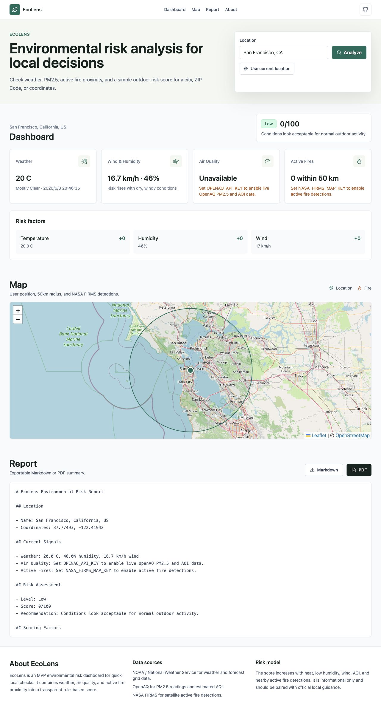

# EcoLens

EcoLens is a lightweight environmental risk analysis tool. Users enter a city, US ZIP Code, or latitude/longitude and receive weather, PM2.5 / AQI, nearby active fire detections, a simple risk level, a map, and an exportable report.

## Live Website

Try the public GitHub Pages demo:

```text
https://kaitangkevin.github.io/EcoLens/
```

GitHub Pages can host the React frontend, but it cannot run the Python FastAPI backend. The public Pages site therefore runs in browser-only weather mode: city / ZIP / coordinate search updates the map and NOAA weather for supported US locations, while OpenAQ AQI and NASA FIRMS active fire data require the backend.

For live NOAA / OpenAQ / NASA FIRMS data, run the backend locally or deploy it to Render / Railway and point the frontend to that backend URL.



## Features

- Location search by city, US ZIP Code, or coordinates.
- Current weather-style signals from NOAA / National Weather Service forecast grid data.
- OpenAQ PM2.5 lookup and estimated US AQI.
- NASA FIRMS active fire detections within 50 km.
- Rule-based risk score: `Low`, `Moderate`, `High`, or `Extreme`.
- Leaflet map with user location, 50 km radius, and fire markers.
- Export report as Markdown or PDF.
- GitHub Actions checks for frontend build and Python tests.

## Tech Stack

- Frontend: React, Vite, TypeScript
- UI: Tailwind CSS
- Map: Leaflet, React Leaflet
- Backend: Python FastAPI
- Data APIs: NOAA / National Weather Service, OpenAQ, NASA FIRMS
- Geocoding helper: Open-Meteo Geocoding API and Zippopotam for US ZIP Codes
- Deployment: Vercel for frontend, Render or Railway for backend

## Project Structure

```text
.
├── backend/app          # FastAPI backend
├── src                  # React frontend
├── tests                # Python risk tests
├── docs/screenshots     # Demo screenshot placeholders
├── .github/workflows    # CI checks
├── API_USAGE.md
├── README.md
├── requirements.txt
└── package.json
```

## Prerequisites

- Node.js 20+
- Python 3.11+
- Optional API keys:
  - OpenAQ API key: https://explore.openaq.org/register
  - NASA FIRMS MAP_KEY: https://firms.modaps.eosdis.nasa.gov/api/map_key/

The app can run without optional API keys. Weather still works for supported US locations; OpenAQ and FIRMS cards will show setup messages until keys are configured.

## Download the Full Project

You can download the complete project in either of these ways.

Clone with Git:

```bash
git clone https://github.com/Kaitangkevin/EcoLens.git
cd EcoLens
```

Or download a ZIP file:

1. Open https://github.com/Kaitangkevin/EcoLens.
2. Click `Code`.
3. Click `Download ZIP`.
4. Unzip the file and open the extracted `EcoLens` folder in a terminal.

## Run Locally with Live Backend

This is the recommended way to use EcoLens on your own computer. You need two terminal windows: one for the backend and one for the frontend.

Important: `localhost` means your own computer. When the README says `http://localhost:5173`, it is not Kai Tang's computer. It is the local development website that opens after you run the commands below.

1. Create the environment file.

```bash
cp .env.example .env
```

2. Install frontend dependencies.

```bash
npm install
```

3. Create and activate a Python virtual environment.

```bash
python3 -m venv .venv
source .venv/bin/activate
pip install -r requirements.txt
```

On Windows PowerShell, activate the environment with:

```powershell
.venv\Scripts\Activate.ps1
```

4. Start the backend in the first terminal.

```bash
uvicorn backend.app.main:app --reload --port 8000
```

The backend should be available at:

```text
http://localhost:8000
```

5. Start the frontend in a second terminal.

```bash
npm run dev
```

6. Open the frontend URL printed by Vite, usually:

```text
http://localhost:5173
```

Now enter a city, ZIP Code, or coordinates and click `Analyze`.

## What Works Locally

- City, ZIP Code, and coordinate search works.
- NOAA / National Weather Service weather works for supported US locations without an API key.
- OpenAQ PM2.5 / AQI works after you add `OPENAQ_API_KEY` to `.env`.
- NASA FIRMS active fire detections work after you add `NASA_FIRMS_MAP_KEY` to `.env`.
- Map visualization and report export work from the frontend.

## Can I Open It by Double-Clicking HTML?

Not for the full app. EcoLens is a React + Vite + FastAPI project, so the normal local workflow is to run the frontend and backend commands above.

The GitHub Pages link is the easiest click-to-open version. The local setup is the full live-data version.

## Configuration

Edit `.env`:

```bash
FRONTEND_ORIGIN=http://localhost:5173
CONTACT_EMAIL=you@example.com
OPENAQ_API_KEY=your-openaq-key
NASA_FIRMS_MAP_KEY=your-firms-map-key
NASA_FIRMS_SOURCE=VIIRS_NOAA20_NRT
VITE_API_BASE_URL=http://localhost:8000
```

`CONTACT_EMAIL` is used in API `User-Agent` headers for NWS and geocoding requests.

## API Usage

See [API_USAGE.md](API_USAGE.md) for endpoint examples and external API notes.

## Risk Scoring

EcoLens uses transparent MVP rules:

- Hotter temperatures add risk.
- Lower humidity adds risk.
- Higher wind speed adds risk.
- Higher AQI adds health risk.
- Any NASA FIRMS active fire within 50 km adds wildfire risk.

The score is capped at 100 and mapped to four levels:

- `Low`: 0-24
- `Moderate`: 25-49
- `High`: 50-74
- `Extreme`: 75-100

## Demo Screenshots

Verified local run:


Design placeholders:


Replace the placeholder SVG files with additional real screenshots before a final public launch.

## Deployment

### GitHub Pages Demo

This repository includes a GitHub Pages workflow for a browser-only frontend demo:

```text
https://kaitangkevin.github.io/EcoLens/
```

GitHub Pages only hosts static frontend files. It cannot run the Python FastAPI backend. The Pages build can geocode locations and fetch NOAA weather in the browser, but full live AQI and active fire data require a deployed backend with `VITE_API_BASE_URL`.

### Frontend on Vercel

1. Import the GitHub repository into Vercel.
2. Set framework preset to `Vite`.
3. Set environment variable:

```text
VITE_API_BASE_URL=https://your-backend-service.example.com
```

4. Deploy.

### Backend on Render

Use these settings:

- Build command: `pip install -r requirements.txt`
- Start command: `uvicorn backend.app.main:app --host 0.0.0.0 --port $PORT`
- Environment variables:
  - `FRONTEND_ORIGIN=https://your-vercel-app.vercel.app`
  - `CONTACT_EMAIL=you@example.com`
  - `OPENAQ_API_KEY=...`
  - `NASA_FIRMS_MAP_KEY=...`

### Backend on Railway

1. Create a new Railway service from the repository.
2. Add the same backend environment variables.
3. Use start command:

```bash
uvicorn backend.app.main:app --host 0.0.0.0 --port $PORT
```

## Checks

```bash
npm run build
pytest
```

GitHub Actions runs both checks on pushes and pull requests.

## Data Source Notes

- NWS gridpoint docs explain that `/points/{lat},{lon}` provides the `forecastGridData` link for a location.
- OpenAQ v3 uses API keys via the `X-API-Key` header and supports point-radius geospatial queries.
- NASA FIRMS Area API requires a free MAP_KEY and returns active fire detections as CSV.
- EcoLens uses Open-Meteo Geocoding for city lookup and Zippopotam for US ZIP Code lookup.

## License

MIT

## Creator

Hello! I’m Kai Tang, a student at the University of Washington and an aspiring data analyst, developer, and entrepreneur.

I build software, websites, and AI-driven tools that focus on solving practical problems. My work combines data analytics, information management, and user-centered design to create meaningful digital experiences.

Currently, I’m exploring the intersection of technology, artificial intelligence, and sustainability while developing projects ranging from web platforms to mobile applications.

I believe that the best technology is not the most complicated one—it is the one that people can actually use.

“Build useful things. Learn continuously. Share openly.”

## Personal Tags

Environmental data · Climate risk · GIS mapping · Wildfire monitoring · Air quality · Public safety · Open data · React · FastAPI · Full-stack engineering
